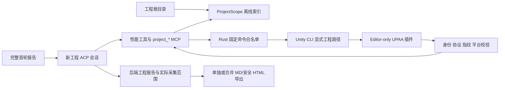

# 架构与数据契约

## 项目流程与存档（版本 3）

桌面首页 → `workflow_command` 项目／轮次 → 后端串行性能诊断与工程定位 → `optimization_command` 新修改会话 → 检查／A-B／决定。诊断和定位不会由前端收到结束事件后自行串接，页面关闭或轮询不会启动任务。普通分析与只读查询接口保留。

`optimization.json` 是最后提交的项目索引；`objects/<SHA-256>.json` 保存独立的录制、轮次、报告、运行和字节备份；`journals/<运行或报告 ID>.jsonl` 顺序追加正文与终态。正文提交后才更新可见内容；重启按偏移重放未检查点化内容，残缺的最后一行不视为提交。生成新对象后原子替换索引，失败不会覆盖旧索引。未引用对象保留，不在恢复时自动清理。

原录制引用有内容指纹，运行时按需重建解析上下文；不恢复旧 ACP 会话或 scope ID。旧 v1/v2 索引完整备份后迁移。工程不存在仍允许打开报告；修改和回退要求原工程可用。工作区租约与工程租约沿用原机制。

本页区分现有实现与目标设计。评估基线、验证结果和优先级统一维护在[项目状态](project-status.md)，使用方法见 [README](../README.md)。

## 当前项目数据流

```text
新建／打开项目 → 持久化项目及当前轮次
  → 绑定 A／B：校验字节 → 阻塞解析 → 阻塞聚合 → 保存结果
  → 一键诊断：性能新会话 → 工程准备／Editor 检查 → 定位新会话
  → 用户点击开始优化：独立修改 Agent／新会话 → 受限编辑与检查
  → A/B 对比 → 接受或回退 → 下一轮基线
  → 历史轮次：分页报告、修改差异、检查与导出（只读）
正文／终态先写入日志；公开活动单独落盘后通知，重开按身份与游标恢复
```

进度分校验、解析、汇总、保存；有实际字节总量才显示比例。JSON 反序列化与汇总显示活动状态，不推算百分比。保存成功才完成绑定，失败保留已有 A／B。

## 兼容录制接口数据流

```text
React：点击文件选择框
  → upload(filePath)：登记原文件路径与 fileId 到 AppState
  → analyze(fileId)
      → .data：阻塞任务中分块读取，发送 parse-progress
      → JSON：阻塞任务读取，类型化识别 dump / V1 / V2 / 数组
      → RAW / PD3U：格式识别与估算，性能指标不可用
      → ParsedProfile（全部帧的合并摘要 + warnings + 原始结构查询源）
      → extractor（阻塞任务中聚合有效帧，输出 nullable 指标和质量信息）
      → MetricsSnapshot 与查询源缓存在 AppState，快照返回前端
  → frame_details / cpu_hierarchy：阻塞任务中读取目标帧，返回有界分页
  → release_file：移除路径登记、快照和查询源
  → diagnose(fileId, agentId)
      → 原子绑定快照/详情/本地 sessionId，拒绝同文件重复诊断
      → 独立 MCP 服务 + 临时工作目录 + Agent 进程
      → ACP initialize → session/new（MCP 桥配置）→ session/prompt
      → Agent 经 MCP 查询 → session/update → 带会话标识的事件 → React
      → 正常完成/错误/取消 → 撤销 MCP、回收进程树与临时目录

MCP：rmcp 服务 → 会话专属本机认证通道 → 应用 --mcp-bridge → Agent stdio
```

`upload` 不复制文件；文件必须在分析时仍可访问。兼容录制页面的文件入口是点击选择，拖放仅有视觉反馈。解析进度主要报告字节数，中途 `currentFrame` 为零。

## 模块边界

| 模块 | 现有职责与限制 |
|---|---|
| [commands](../src-tauri/src/commands/mod.rs) | 文件、分析、查询、诊断与按 sessionId 取消命令 |
| [parser](../src-tauri/src/parser/mod.rs) | 格式分派及 ParsedProfile / Frame / Sample；不等于所有格式都能完整解析 |
| [data](../src-tauri/src/parser/data/mod.rs) | 分块读取；6000.3.23f1 / 6000.3.9f1 使用顺序结构解码和跨帧 marker 状态，输出 CPU / GC / 五类渲染计数；其他 Unity 6 版本仅提供帧头 CPU 估算，旧启发式扫描不参与指标 |
| [extractor](../src-tauri/src/extractor/mod.rs) | 聚合快照；保留全帧时间线，无固定 20–50KB 上限 |
| [state](../src-tauri/src/state/mod.rs) | 路径、快照、详情源和会话句柄；同文件诊断互斥、释放时取消 |
| [acp_client.rs](../src-tauri/src/acp_client.rs) | ACP v1 会话与 MCP 生命周期；手写 JSON-RPC 消息状态机，尚未验证其他协议版本 |
| [acp_client/client.rs](../src-tauri/src/acp_client/client.rs) | 子进程、Windows shim、协作取消句柄和 Windows Job Object |
| [mcp](../src-tauri/src/mcp/mod.rs) | 会话 MetricsStore、rmcp Server、类型化分派与本机 stdio 桥 |
| [useDiagnose](../src/hooks/useDiagnose.ts) | 页面状态、早到事件缓冲、fileId/sessionId 过滤和取消 |

## 当前数据契约与风险

- dump 独立解析线程/样本树并校验，CPU 取唯一 Main Thread 根样本，GC 统计全部已导出线程。站点归因按线程和最近非 GC.Alloc 父样本；inclusive 热点不可相加。
- 内部 Frame 通过 FrameQuality 保存字段是否可用。旧内部数值占位不能直接消费；extractor 仅聚合有效值，公开快照中不可用数值为 null。
- FrameTimeStats 的 quality 包含 status（available / partial / unavailable / estimated）、source、reasons、validFrames、totalFrames。CPU 热点、GC 站点、渲染事件有独立质量信息；无效帧不参与分位数。估算混入部分数据时 status 为 partial，reasons 仍说明估算。
- meta.frameCount 是实际分析帧数，declaredFrameCount 是来源声明的录制帧数，source 标识输入；durationMs 为有效帧时间之和，并附 durationQuality。CPU 时间线保留源 frameIndex、nullable ms 与独立 frameTimeMs。
- GC 站点 DTO 使用 totalBytes / avgBytes / maxBytes，不再复用 ms 字段。Gen 回收次数和 SRP 节省没有观测数据，返回 null。
- V1 缺 cpuMs 不用 durationMs 替代主线程时间；V2 估算明确标记。6000.3.23f1 / 6000.3.9f1 data CPU 来自唯一主线程根样本，GC 来自全部线程的索引记录并与通用 metadata 交叉核对；录制帧时间来自相邻帧起始纳秒差，按 Editor 的 float32 转换，末帧或时间戳倒退时不可用。data 渲染计数由 Counter marker metadata 读取，按有效帧聚合；缺失与冲突不补零。渲染 CPU marker 不代表 GPU，SRP 收益及 RAW/PD3U 性能指标不可用。详见[渲染契约与验证](rendering-validation.md)。
- 快照之外保留逐帧查询源：data 使用字节索引与 marker 状态，dump 使用自动清理的临时文件；查询保留原始父子关系和线程，不再用全局热点冒充调用树。详见[查询契约](frame-queries.md)。MCP 服务复用查询源，经本机认证桥提供 stdio；绑定桌面诊断会话并随会话撤销。
- dump 与结构化 data 在每帧内合并同名 CPU 摘要，以及同线程、同归因名称的 GC 站点，保留调用次数、总量和最大值。摘要行数不再等于原始样本数；原始树、marker ID、索引与父子关系仍由查询源完整提供，不截断为 top N。
- JSON 类型化反序列化避免完整 Value 树，仍持有输入字节与解析结果；data 累积全部 Frame。兼容录制页面重置和替换输入会释放登记、快照和查询源；项目已存档报告与摘要不随运行时查询源释放而删除；在途查询结束后释放最后引用。独立解析进程、桌面 IPC、结果页渲染与 DOM 对照测量见[性能记录](performance-and-release.md)，完整桌面应用预算仍待验证，不承诺固定快照大小。
- 文件读取、主要解析与提取已从异步命令隔离到阻塞任务。项目入口已有分阶段进度；data 解析显示字节进度，JSON 反序列化阶段显示未知比例的活动条。旧 analyze 接口保留其原进度协议。
- CSP 已配置；没有统一文件大小上限，误导性的 500MB 提示已移除。Windows Job Object、取消和异常终态已有进程回归；release 桌面主流程已有验收，原生文件选择与安装向导已有维护者历史人工确认；其他平台进程树仍待验证，历史包证据不外推到新构建。
- Agent 诊断在独立临时目录运行，只授权当前会话的 Profiler MCP 查询。未声明文件/终端能力不等于操作系统沙箱；其他 Agent 的权限语义需要独立验收。

## 目标数据流与验收边界

```text
录制 + Unity Editor 对照
  → 按版本解析、结构校验、标注缺失/估算/来源
  → 保留原始帧标识、线程、调用树与明确单位的内部模型
  → 摘要与按帧查询视图
      → 前端展示可用性与证据
      → 可运行 MCP Server 提供有界查询
  → ACP initialize / session/new / session/prompt
      → Agent 查询 MCP → session/update → 前端
      → 会话管理统一处理取消、异常、退出与资源释放
```

保留 parser → extractor 分层。P0 数据质量、P1 调用树和 Windows Claude Code ACP 数据查询闭环已有证据，原始目标没有缩减为仅协议 fixture。release 桌面主流程已通过限定范围验收，原生窗口有历史人工证据；更多录制、未验证 Agent 和正式发布仍待验收。MCP 数据通过会话专属本机桥访问，Arc 只在父进程内部共享。

性能预算、安装包体积和跨平台能力均属于待验证目标。测量需要同时记录录制规模、硬件、耗时、峰值内存与保留数据量，不能仅凭分块读取作容量承诺。

## 兼容录制接口的报告与源码定位

`state::AppState` 在录制内存生命周期内保存 `reports::Report` 和 `source::SourceScope`。ACP 事件先由后端更新报告，再转发 UI；会话只允许一次终态，正文上限由 ACP 输入和报告存储双重检查。UI 的事件日志可以限长，导出和终态正文从后端报告读取。

源码准备在可取消的阻塞任务中生成范围 ID、相对路径索引和文件哈希；源码 ACP 会话从后端取得完整首轮报告，并使用带该范围的独立 `MetricsStore`。只有这类会话的 MCP 工具列表包含源码查询工具。文件读取重新验证范围及哈希，Agent 临时工作目录不变。

UI 和导出 HTML 使用同一个 `reports::render_markdown`，Markdown 导出保留正文。导出先校验录制和父子报告关系，再在阻塞任务中写同目录临时文件并替换目标。重置/切换录制释放报告、取消准备和源码范围，不删除用户已导出的文件。详细接口与限制见[报告与源码指南](reports-and-source.md)。


## Unity 工程联合定位

`project::ProjectScope` 在 `spawn_blocking` 中流式索引工程内文本，记录 GUID/fileID、原始 PPtr、哈希及覆盖缺口；`project::files` 负责规范路径、Windows 文件句柄和编码/大小校验。C# 旧范围不变。



工程定位会话注册 `project_*` 查询及 `project_propose_tasks` 候选任务工具；自动修改会话也持有工程只读查询范围，普通诊断没有工程访问范围；提案不授权写入。AI 无权使用 CLI 的通用执行命令。Editor 插件按对象分批读取，取消是协作式批次检查，不可中断同步 Unity API。只采集已加载场景，外部包只返回当前工程解析的资源摘要。Editor 不可用仍可离线定位，报告明确缺少相关证据；不同平台/版本及变化的资源指纹拒绝混用。完整限制见[工程定位指南](project-diagnosis.md)。

## 持久化优化项目

`optimization/` 管理项目、轮次、任务版本、修改运行、文件前后字节、检查及 A/B。`optimization_command` 接收操作标签；每次 Start 独立新建 ACP 会话，拒绝旧 session ID。普通诊断的 `MetricsStore` 没有编辑范围；旧受限修改会话增加 `optimization_context/read/replace/check`，后端校验批准任务与文件指纹；自动模式的新增工具和范围见下节。

保存目录中的 `optimization.json` 与首次写入备份先落盘，再对目标文件做单文件替换。应用中断后核对 prepared 条目；回退按逆序、内容指纹和后续轮次依赖执行。跨进程锁分别保护保存目录及 Unity 工程，仍不等价于文件系统沙箱。

Unity 固定检查协议与只读采集协议分开版本化。编译、相关 Shader 导入和选定 EditMode 测试由 Editor 执行；检查记录跨域重载保存在 Library。业务文件监测出现变化时暂停后续编辑。A/B 保存独立录制指纹及紧凑帧指标，调用树仍按需读取原录制，统计只使用有效值。完整限制和状态见[优化项目说明](optimization-loop.md)。


### 自动优化模式

旧兼容入口 `prepareAutomatic` 仍可按规范化工程路径复用工作区；新主流程在导入前通过 `workflow_command` 创建工作区，`startAutomatic` 仅接收轮次、Agent 和补充要求。新会话同时持有性能及工程只读查询范围，后台内部任务无需前端逐项授权。`optimization_task/create` 仅对自动修改会话开放，原 `start` 保留文件白名单。

版本 2 引入的 modify/create/directory/metadata 记录在当前版本 3 存档中继续保留。新文件用同目录临时文件完整写入并无覆盖发布；生成的 meta 由后台管理，只自动接受换行/空白及明确的空默认导入字段变化。回退前检查新依赖及后续轮次，不完整扫描停止删除。固定 Unity 检查先刷新 AssetDatabase，使新增或回退移除的代码与编译输入同步；范围外文件变化仍暂停。


### 项目实时观察

解析进度使用持久化项目／轮次身份及本次操作 ID，通过 `workflow-progress` 通知并在项目视图提供最新快照；百分比只描述当前有准确字节总量的阶段。

公开 AI 活动写入 `activity/<运行或报告 ID>.jsonl` 并同步后，通过 `workflow-activity` 通知。序号是提交记录的字节起点，`nextCursor` 只允许记录边界；读取按轮次校验所属报告／运行，分批最多 100 条。界面用游标补读和去重，事件只是唤醒提示。每次日志上限 10 MiB，预留明确的上限记录；正文保持原报告日志与 2 MiB 上限，工具摘要不改变执行授权。

核心工作区通过可选通知回调与 Tauri 解耦，使解析、存档和恢复测试无需加载 Windows GUI 运行时。工具活动只采集实际 MCP 调用的开始和结果状态；不把 ACP 私有推理或工具返回全文加入活动记录。

## 项目绑定的插件安装

`workflow_command` 的 `pluginStatus`、`pluginInstall`、`pluginRecords` 使用当前项目 ID，不接受前端提供安装路径。安装与工作流运行互斥，使用工程／存档租约和 Windows 目录句柄，要求目标 Editor 关闭；安装期间独占 UnityLockfile。不经 MCP 开放，代码优化也不能修改本插件。

构建阶段将插件字节与 SHA-256 清单编入程序，安装前校验；以工程内嵌包部署并保留 meta。首次写入前将 manifest 原始／目标字节及工程身份保存到独立 `plugin-install.json`，校验暂存目录后发布，最后仅移除插件的旧 `file:` 依赖项。失败保留中断记录，继续安装核对原始／目标指纹；已有不同内容、Git／registry 来源及外部变动不会被覆盖。lock 文件只检查、不重写，由 Unity 解析。

内嵌包状态与 Editor ready 状态独立；程序不自动安装 CLI、升级 Unity 或修改其他依赖。团队共享验收见[插件验收](evidence/plugin-install-validation.md)。
